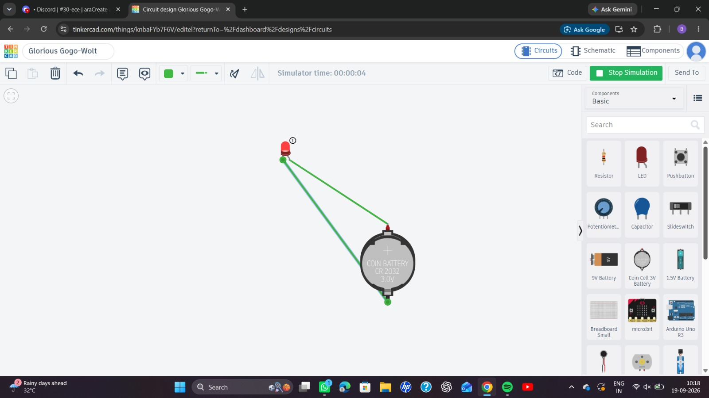
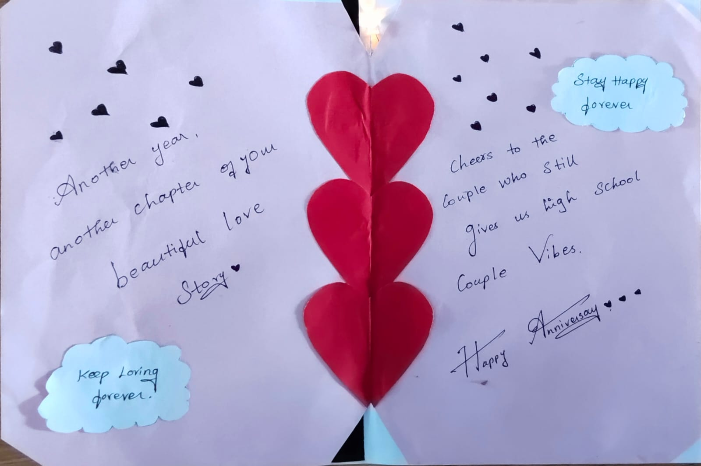

&nbsp;&nbsp;&nbsp;&nbsp;&nbsp;&nbsp;&nbsp;&nbsp;&nbsp;&nbsp;&nbsp;&nbsp;&nbsp;&nbsp;&nbsp;&nbsp;&nbsp;&nbsp;&nbsp;&nbsp;&nbsp;&nbsp;&nbsp;&nbsp;&nbsp;&nbsp;&nbsp;&nbsp;&nbsp;&nbsp;&nbsp;&nbsp;&nbsp;&nbsp;&nbsp;&nbsp;&nbsp;&nbsp;&nbsp;&nbsp;&nbsp;&nbsp;&nbsp;&nbsp;&nbsp;&nbsp;&nbsp;&nbsp;&nbsp;&nbsp;***GREETING CARD***

&nbsp;

## **Objective :**

To design and create a creative greeting card by integrating **paper-based artwork with a simple electronic circuit**, using an LED, CMOS battery, and aluminium foil as the electrical connection.

&nbsp;

**Materials Used :**

| Component | Purpose |
| ----- | ----- |
| Greeting card / chart paper | Main structure and decorative base |
| LED | Produces light as the electronic effect |
| CMOS/coin-cell battery | Provides electrical power |
| Aluminium foil | Used as a conductive path instead of conventional wires |
| Tape/adhesive | Fixes the components and connections |
| Coloured paper | Used for decorative heart designs |
| Marker/pen | Used for greetings and artwork |

&nbsp;

**Methodology :**

&nbsp;

&nbsp;&nbsp;&nbsp;&nbsp;&nbsp;&nbsp;&nbsp;&nbsp;CMOS Battery

&nbsp;&nbsp;&nbsp;&nbsp;&nbsp;&nbsp;&nbsp;&nbsp;&nbsp;&nbsp;&nbsp;&nbsp;&nbsp;│

&nbsp;&nbsp;&nbsp;&nbsp;&nbsp;&nbsp;&nbsp;&nbsp;&nbsp;&nbsp;&nbsp;&nbsp;&nbsp;↓

&nbsp;&nbsp;&nbsp;&nbsp;&nbsp;Aluminium Foil Path

&nbsp;&nbsp;&nbsp;&nbsp;&nbsp;&nbsp;&nbsp;&nbsp;&nbsp;&nbsp;&nbsp;&nbsp;&nbsp;│

&nbsp;&nbsp;&nbsp;&nbsp;&nbsp;&nbsp;&nbsp;&nbsp;&nbsp;&nbsp;&nbsp;&nbsp;&nbsp;↓

&nbsp;&nbsp;&nbsp;&nbsp;&nbsp;&nbsp;&nbsp;&nbsp;&nbsp;&nbsp;&nbsp;&nbsp;LED

&nbsp;&nbsp;&nbsp;&nbsp;&nbsp;&nbsp;&nbsp;&nbsp;&nbsp;&nbsp;&nbsp;&nbsp;&nbsp;&nbsp;

## &nbsp;**Circuit diagram**             

&nbsp;

&nbsp;

&nbsp;

&nbsp;

**Key Learning Outcomes :**

* Understanding a basic LED circuit  
* Understanding battery-powered DC circuits  
* Learning how conductive materials can replace wires  
* Basic circuit integration into a physical design  
* Combining **electronics with creative engineering**

### 

### 

### **Short conclusion :**

* The project successfully demonstrates how a simple electronic circuit can be integrated into a handmade greeting card. By using an LED, CMOS battery, and aluminium foil as a conductive path, the team created a low-cost and creative electronic greeting card while applying basic principles of electrical and electronic engineering.

&nbsp;

&nbsp;***Our Greeting Card:***&nbsp;

&nbsp;&nbsp;&nbsp;&nbsp;&nbsp;&nbsp;&nbsp;&nbsp;&nbsp;&nbsp;&nbsp;&nbsp;

&nbsp;&nbsp;&nbsp;

